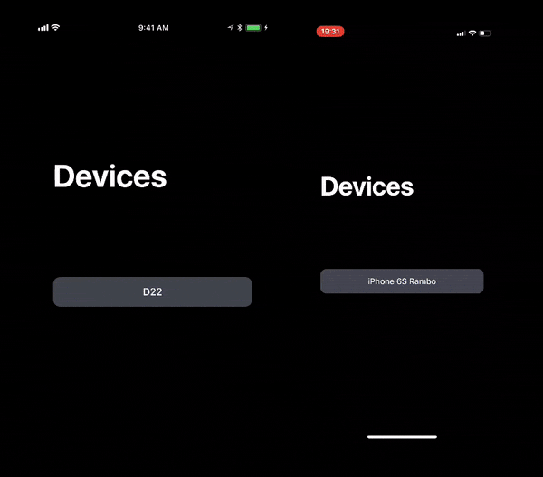

# MultipeerDemo

A sample app showing how to transfer files between two devices using [MultipeerConnectivity](https://developer.apple.com/documentation/multipeerconnectivity).

This sample app is part of my talk on MultipeerConnectivity, you can get the [slides in Portuguese](GuilhermeRambo-MultipeerConnectivity-pt.pdf) and [in English](./GuilhermeRambo-MultipeerConnectivity-en.pdf).

